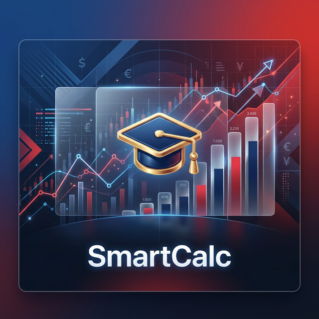
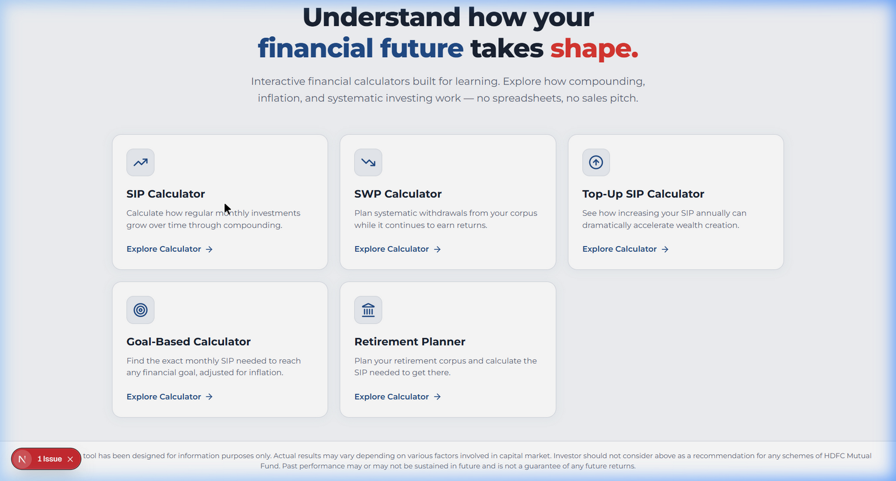
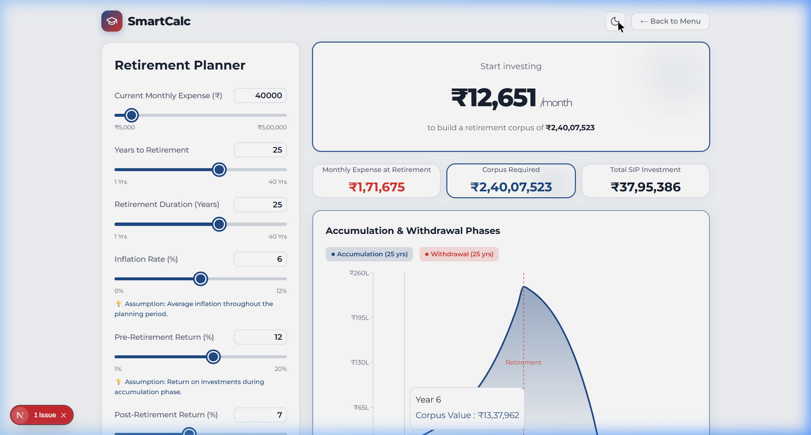

# SmartCalc – Interactive Financial Learning Platform



SmartCalc is a modern, interactive financial calculator platform designed for the **FinCal Innovation Hackathon**. It transforms traditional spreadsheet-style tools into a visually engaging and educational experience for everyday investors.

---

## 🚀 Key Highlights

- **Visual Literacy**: Dynamic charts and interactive sliders make complex finance intuitive.
- **Brand Alignment**: Designed with precision using brand-compliant colors (`#224c87`, `#da3832`).
- **Accessibility First**: Fully **WCAG 2.1 AA** compliant for an inclusive financial future.
- **Transparency**: Step-by-step formula explainers for every calculation.

---

## 📱 Interactive Modules

### 1. SIP Calculator
| Growth Visualization | Wealth Composition |
| :---: | :---: |
|  | *Compound interest in action* |

### 2. Retirement Planner (Dark Mode)

*Plan your transition from the Accumulation phase to the Withdrawal phase with inflation-adjusted precision.*

### 3. Comprehensive Feature Set
- **SWP Calculator**: Map out your corpus depletion with safety warnings.
- **Top-Up SIP**: See how 10% annual increases can double your wealth.
- **Goal-Based Investing**: Reverse-engineer your SIP from a future milestone cost.

---

## 🛠️ Technical Excellence

- **Core**: Next.js 15 (App Router)
- **Styling**: Modern CSS System (Glassmorphism + Semantic Tokens)
- **DataViz**: Real-time rendering with Recharts
- **Aesthetics**: Framer Motion for premium micro-interactions

---

## 🏃 How to Run Locally

1. **Clone & Enter**:
   ```bash
   git clone https://github.com/iamshresthraj/SmartCalc.git
   cd SmartCalc
   ```

2. **Setup**:
   ```bash
   npm install
   ```

3. **Launch**:
   ```bash
   npm run dev
   ```

4. **Navigate**:
   Open [http://localhost:3000](http://localhost:3000)

---

## ⚖️ Compliance & Disclaimer

> [!IMPORTANT]
> This tool has been designed for information purposes only. Actual results may vary depending on various factors involved in capital market. Investor should not consider above as a recommendation for any schemes of HDFC Mutual Fund. Past performance may or may not be sustained in future and is not a guarantee of any future returns.

---
Built for the **FinCal Innovation Hackathon**
