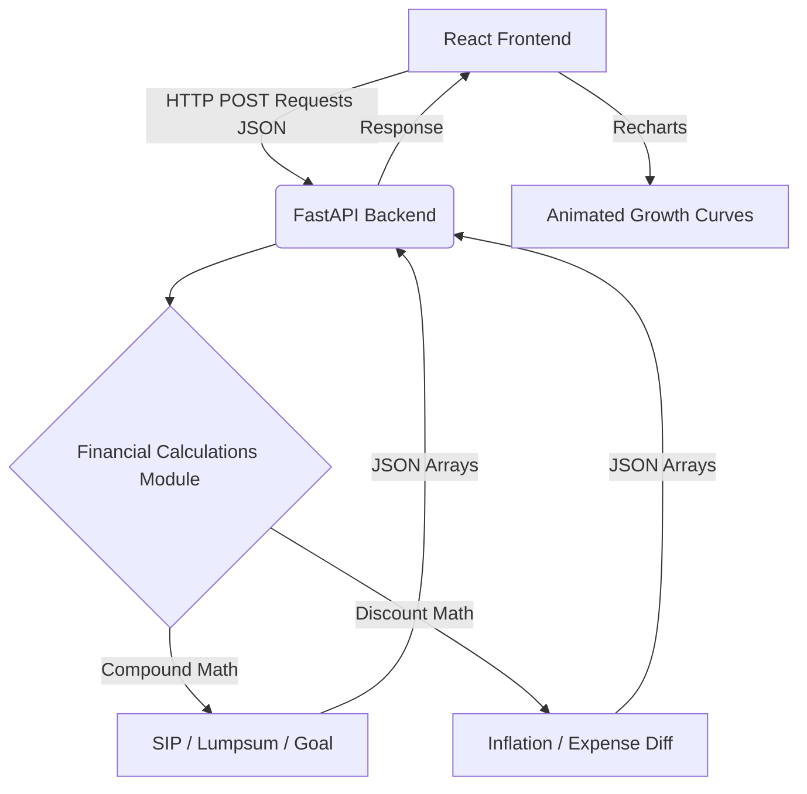

# SmartCalc - Interactive Financial Learning Calculator

A modern, highly interactive web application designed for the **FinCal Innovation Hackathon**. SmartCalc focuses on transforming complex financial mathematics into an engaging, visual storytelling experience that teaches everyday users about exponential wealth growth, inflation, and fee impact.

## Problem Statement

Financial literacy is low, and most investment calculators behave like boring, complex spreadsheets. Beginners are intimidated by terms like "CAGR", "Systematic Investment Plan", and "Expense Ratios". They struggle to visualize the sheer power of compounding or the silent wealth destruction caused by inflation and fees.

## Solution Approach

SmartCalc bridges the gap between financial mathematics and interactive learning. Instead of just showing numbers in tables, SmartCalc uses:
- **Interactive UI Sliders** for instant variable manipulation.
- **Real-time area charts** demonstrating parabolic growth over decades.
- **Glassmorphism design** for a premium, Fintech-style aesthetic.
- **In-context educational tooltips** that explain *why* the math works, without the jargon.

## Features

1. **SIP Growth Simulator**: Demonstrates the immense power of compounding over time with regular monthly investments.
2. **Lump Sum Investment**: Compares identical timeframes to show how early investments snowball faster.
3. **Financial Goal Planner**: A reverse-engineered calculator that tells users exactly what they must save monthly to hit a target.
4. **Inflation Impact Calculator**: Visually models the declining purchasing power of static cash over long horizons.
5. **Expense Ratio Simulator**: Exposes "The 1% Illusion"—how tiny fees mathematically destroy millions in potential wealth.

## Tech Stack

**Frontend Framework:** React + Vite
**Styling:** Tailwind CSS (Modern Glassmorphism)
**Animations & UI:** Framer Motion
**Data Visualization:** Recharts
**Backend Framework:** Python + FastAPI
**Architecture:** REST API

## Architecture Diagram



## Installation & Setup

### 1. Setup the Backend
Navigate to the root directory `finlearn-calculator` and install the Python dependencies:
```bash
pip install -r requirements.txt
```
Run the FastAPI backend on port 8001:
```bash
python -m uvicorn backend.main:app --port 8001 --reload
```

### 2. Setup the Frontend
Open a new terminal, navigate to the `frontend` folder, and install the Node modules:
```bash
cd frontend
npm install
```
Start the React development server:
```bash
npm run dev
```

### 3. Usage Instructions
1. Open your browser to the local address provided by Vite (usually `http://localhost:5173`).
2. Select any financial module from the home dashboard.
3. Move the interactive sliders and watch the real-time changes in the "Exponential Growth Curve" graphs.
4. Hover over the "❓" tooltips for simple, jargon-free educational insights.

## Future Improvements
- Expand into Tax-saving calculation models (ELSS vs standard mutual funds).
- Provide downloadable PDF summary reports for user goal tracking.
- Add user authentication to securely save goal portfolios.
